```{r setup, include=FALSE}
knitr::opts_chunk$set(echo = TRUE, message = F, fig.align = "center", out.width = "80%", eval = T)
```

# Background {.tabset}

## Algoritma

The following coursebook is the main part for *Text Classification with Deep Learning in R* workshop produced by the team at [*Algoritma*](http://algorit.ma/). Algoritma is a data science education center based in Jakarta. We organize workshops and training programs to help working professionals and students gain mastery in various data science sub-fields: data visualization, machine learning, data modeling, statistical inference, etc.

Before you go ahead and run the codes in this coursebook, it's often a good idea to go through some initial setup. Under the Training Objectives section we'll outline the syllabus, identify the key objectives and set up expectations for each module. Under the Libraries and Setup section you'll see some code to initialize our workspace and the libraries we'll be using for the projects. You may want to make sure that the libraries are installed beforehand by referring back to the packages listed here.

## Library and Setup

In this **Library and Setup** section you'll see some code to initialize our workspace, and the packages we'll be using for this project.

*Packages* are collections of R functions, data, and compiled code in a well-defined format. The directory where packages are stored is called the library. R comes with a standard set of packages. Others are available for download and installation. Once installed, they have to be loaded into the session to be used.

You will need to use `install.packages()` to install any packages that are not yet downloaded onto your machine. To install packages, type the command below on your console then press ENTER.

```{r eval=FALSE}
package <- c("tidyverse", "tidytext", "hunspell", "yardstick", "e1071", "keras", "scales", "tm", "furrr")
install.packages(package)
```

To install `textclean` package, you will require the `pacman` package. Run the following code on your console to install the package.

```{r eval=FALSE}
if (!require("pacman")) 
  install.packages("pacman")
pacman::p_load_gh(
    "trinker/lexicon",    
    "trinker/textclean"
)
```

Then you need to load the package into your work space using the `library()` function. The rmarkdown packages do not need to be called using library().

```{r message=FALSE}
# Data Wrangling
library(tidyverse)

# Text Preprocessing
library(tidytext)
library(textclean)
library(hunspell)

# Parallel Computing
library(furrr) 

# Model Evaluation
library(yardstick)

# Naive Bayes
library(e1071)

# Deep Learning
library(keras)
use_condaenv("r-tensorflow")

# Labeling Text
library(scales)

# ggplot2 Plot Configuration
theme_set(theme_minimal() +

            theme(legend.position = "top")
          )
```

## Training Objectives

This online workshop is a beginner-friendly introduction to Text Classification using R. You will learn about how to handle text data, machine learning workflow, and the algorithm behind the Deep Learning.

```{r echo=FALSE}
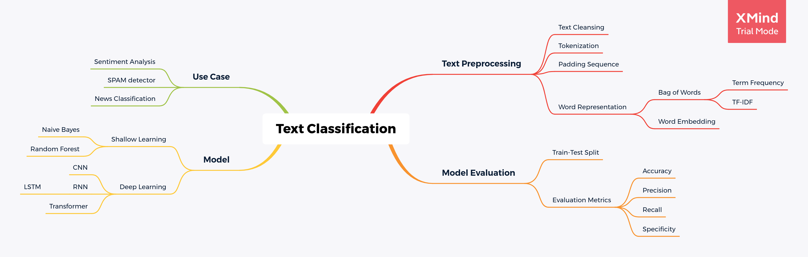
```

-   **R PROGRAMMING BASICS**

    -   Introduction to R Programming Language
    -   Working with R Studio Environment
    -   Using R Markdown for reproducible research

-   **Text Preprocessing**

    -   Text cleansing
    -   Tokenization
    -   Text as a sequence: padding and truncating

-   **Text Classification with Deep Learning**

    -   Train-Test split
    -   Deep Learning fundamentals
    -   Best practice and state-of-the-art model architecture
    -   Long-Short Term Memory (LSTM) layers
    -   Model Evaluation

# Preface

Text mining, also referred to as text data mining, similar to text analytics, is the process of deriving high-quality information from text. There are many application of text mining, such as:

-   Text Classification
-   Text Summarization
-   Text Generation
-   Text Translation
-   Topic Modeling
-   Named Entity Recognition

Text classification has broad applications such as topic labeling, spam detection, and sentiment analysis. Take a look at a text example of a game review below:

> This game is for you who love RPG.

The sentence contains a positive response/sentiment and the user who wrote this is more likely to recommend the game to another user. Now compare the text with the following text:

> This game is a waste of time and is not worth it.

This sentence contains a negative response because it signifies that the user didn't enjoy the game as much and is more likely to not recommend it to other users.

In a grand sense, we are interested in the emotional content of some text, e.g. posts on Facebook, tweets, or movie reviews. Most of the time, this is obvious when one reads it, but if you have hundreds of thousands or millions of strings to analyze, you will be able to do so efficiently. Text classification and sentiment analysis is a common tool to help companies, analysts, and researchers to learn public opinions towards certain topics. It works by extracting sentiment and semantic information from a text document.

There are currently many approach to do text classification, as illustrated with the following figure by Qian Li, et al., 2020[^1].

```{r echo=FALSE}
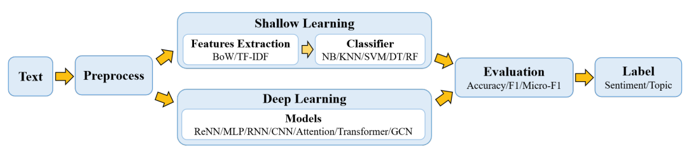
```

There are currently 2 major category of building machine learning for text classification:

-   *Shallow Learning*: Refers to various machine learning models that directly use text representation, such as bag of words, TF-IDF, and word2vec as the features to predict the class of the text. Some example of the machine learning models in this category including Naive Bayes, K-Nearest Neighbor (KNN), Random Forest (RF), and Support Vector machine (SVM).
-   *Deep Learning*: The use of artificial neural network with various model architecture, currently held as the state-of-the-art or the standard procedure to process unstructured data such as text or image. There are many development of Deep Learning, starting from the *Vanilla* neural network which only applies multilayer perceptron (MLP), Recurrent Neural Network (RNN) and its derivation, such as Long-Short Term Memory (LSTM) networks, and also the newly developed Graph Convolutional Network (GCN).

In this workshop, we will focus on one of the standard deep neural network technique to perform text classification: the Long Short-Term Memory (LSTM) networks. While most algorithms only focus on each word as single feature, the unique behavior of LSTM is capable of learning order dependence in text sequences.

# Data

For our use case and as an example, we will use a text classification problem for steam game review. If you ever browsed a game store page in Steam, you might be familiar with the form of the user review such as the following figure. On the top of the review, there is a sign that shows if the user recommend or not recommend the game, followed by the text of the review. We will try to predict if the user will recommend the game based on the content of the review.

```{r echo=FALSE}

```

Data are collected from the [Analytic Vidhya, JanataHack: NLP Hackathon.](https://www.kaggle.com/piyushagni5/sentiment-analysis-for-steam-reviews). The dataset consists of 5 columns and around 17,400 observations.

```{r message=FALSE}
df <- read.csv("data/steam_review.csv")

glimpse(df)
```

Data Description:

-   `review_id`: id of the review
-   `title`: Title of the game
-   `year`: Year in which the review was posted
-   `user_review`: Review of the user
-   `user_suggestion`: Game marked Recommended(1) and Not Recommended(0) by the user

You can check the first 6 reviews using `head()` function. The `$` indicates that we want to select only the `user_view` column from the `df` data.

```{r}
head(df$user_review)
```

# Text Preprocessing

As you can see, the reviews are pretty messy. Some reviews is marked as `Early Access Review` inside the text, there are capital and lower case words, and some people use contracted word such as `I'm` or `I'll` instead of I am or I will. So, before we do any machine learning stuff, we need to clean the contain of the text first.

Text cleansing is one of the main task before building a sentiment analysis or any text classification models. It is also one of the most difficult task, especially if the text is pretty messy and contain a lot of variations. Some general process in text cleansing, which we will also do next, are as follows:

-   Remove all non ASCII characters
-   Make all characters lowercase
-   Remove all mention to name
-   Remove the phrase `early access review`
-   Remove all https or url link
-   Remove all hashtag
-   Remove all html tag
-   Replace a contracted word
-   Remove any word elongation
-   Replace `?` into explicit `quetionmark`
-   Replace `!` into explicit `exclamationmark`
-   Remove all punctuation
-   Remove all numbers
-   Remove unnecessary white space

We can compile the whole text cleansing process into a single function. In the following code, I create a `cleansing_text()` function that will do the process with just one call.

```{r}
cleansing_text <- function(x) x %>% 
                       replace_non_ascii() %>% # remove all non-ASCII characters
                       tolower() %>% # make all characters lowercase
                       str_replace_all(pattern = "\\@.*? |\\@.*?[:punct:]", replacement = " ") %>% # remove mention
                       str_remove(pattern = "early access review") %>% # remove words "early access review"
                       replace_url() %>% # remove url
                       replace_hash() %>% # remove hashtag
                       replace_html() %>% # remove html tag
                       replace_contraction() %>% # replace word contraction
                       replace_word_elongation() %>% # replace word elongation
                       str_replace_all("\\?", " questionmark") %>% # replace question mark
                       str_replace_all("\\!", " exclamationmark") %>% # replace exclamation mark
                       str_replace_all("[:punct:]", " ") %>% # remove punctuation
                       str_replace_all("[:digit:]", " ") %>% # remove numbers
                       str_trim() %>% # remove whitespace at start and end of text
                       str_squish() # remove double whitespace

# Example
cleansing_text("I really love this game !!! 10/10")
```

Since the process of cleansing multiple text will take a quite long time to run, we will use parallel computing to get the job done using the [`furrr` package](https://davisvaughan.github.io/furrr/). Parallel computing will allow us to use more than 1 CPU in our hardware to do the job. If your laptop/device has 4 CPUs, this means that you can process 4 texts simultaneously instead of 1 text at a time.

```{r eval=FALSE, message=FALSE, warning=FALSE}
plan(multisession, workers = 4) # Using 4 CPU cores

df_clean <- df %>% 
  mutate(
    text_clean = user_review %>% 
      future_map_chr(cleansing_text)
    ) 

head(df_clean)
```

If you don't want to wait the process, I have prepared the already processed data. Run the following code to load the data. The data is saved on `.rds` format, which is acronym for R Data Storage.

```{r echo=FALSE}
# Load saved the cleansed data
df_clean <- read_rds("data/cleansed_data.rds") 
glimpse(df_clean)
```

Next, we need to check the length of the sentence on each review after being cleansed. Some text may only contain 1 or 2 words left after being cleansed so they are not very informative.

```{r}
word_count <- map_dbl(df_clean$text_clean, 
                      function(x) str_split(x, " ") %>% 
                        unlist() %>% 
                        length()
                      )

# Statistics of the word count
summary(word_count)
```

We will filter the dataset and will only use texts that at least has 3 words in the sentence. The choice of the minimum number of words is arbitrary.

```{r}
df_clean <- df_clean %>% 
  filter(word_count > 3)

glimpse(df_clean)
```

# Train-Test Split

This step is where we will split our data into 2 separate dataset: training dataset and testing dataset.

-   **Training Dataset**: Dataset that will be used to train the machine learning model
-   **Testing Dataset**: Dataset that will be used to evaluate the performance of the model and check if the model can predict new unseen data.

Why do we need to separate the data? Because the model will always perform better in the data that they've trained with. Imagine where you are doing a math homework. You can easily do them, especially after you check the correct answer and learn what makes you wrong. However, we want our model to be able to predict a new, unseen data. That's why we need the testing dataset. The testing dataset acts as the examination or evaluation for the model, to check whether they can truly learn the pattern inside the data.

```{r echo=FALSE}
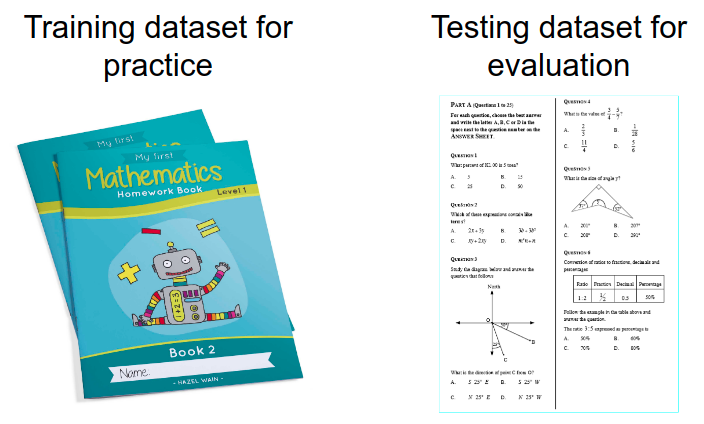
```

We will split the data and 80% of the data will be data train while the rest will be data test. Each observation/row is randomly selected as either the training set or the testing set. The random selection is done to make sure we don't include any selection bias done by human. To make sure that everytime we run the code we will get the same random sample for data train and data test, we will use the `set.seed()` and set the seed of the random generator with 123. The choice of seed is arbitrary.

```{r}
# Random seed for reproducible result
set.seed(123)

# Number of row in data
row_data <- nrow(df_clean) 

# Sample data
index <- sample(row_data, row_data*0.8)

# Create data train and data test
data_train <- df_clean[ index, ]
data_test <- df_clean[-index, ]
```

We need to check the class proportion in the target variabel. Is one class more dominant than others? If there is a great imbalance in the class proportion, such as 20:80 or even 10:90, it will have a great effect toward how our model will learn. The ideal proportion is close to 50:50.

```{r}
table(data_train$user_suggestion) %>% 
  prop.table() * 100
```

# Further Text Preprocessing

The previous part deals with cleansing the text data. In the following section, we will prepare the data so it can be a proper input for our deep learning model.

We will check how many unique words that we have in our corpus/collection of texts in data train. This will help us determine how many words that we will use for the vocabulary of the input data.

```{r}
paste(data_train$text_clean, collapse = " ") %>% 
  str_split(" ") %>% 
  unlist() %>% 
  n_distinct()
```

Based on the result above, we have around 44,206 unique words from the all texts inside the data train. We only look at the data train because that's the data that we will use to train the model and we are forbidden to directly peek at the data test because the data test should only be used for evaluating the model and check if the model is really good at predicting new and unseen data.

## Tokenization

We will transform the text data into token using [`tokenizer`](https://keras.rstudio.com/reference/text_tokenizer.html) from `keras` library. This process is called tokenization because each sentence will broken down into words/terms.

```{r}
# Use top 40,000 words as vocabulary
num_words <- 40*1e3

# Create tokenizer from data train
tokenizer <- text_tokenizer(num_words = num_words) %>% 
  fit_text_tokenizer(data_train$text_clean)
```

Tokenizer will convert our words/terms into a symbol, which is called as `label encoding`. For example, the following output is the label for the top 10 words in our texts. The label is ordered based on the frequency or how many the word appears inside our texts so more frequent words will have smaller label. We can use all available words from our texts, which is 44,206 unique words as we have seen earlier. However, some words may only appear once or twice, such as a person name or name of a place, which is not very informative. Here, I limit the number of words by using only the top 40,000 words from our texts. This means that if there is any words that are not included inside the top 40,000 words will not have any labels and will be removed.

```{r}
head(tokenizer$word_index, 10)
```

After we have created the tokenizer, we can fit new sentence and convert it into a sequence of labeled text. You can check the following sentence, with the word `this` is converted into label `11` and the word `game` is converted into label `6`. The word `lolololololol` is not in our vocabulary so keras is simply remove it from our sequence.

```{r}
texts_to_sequences(tokenizer, "this game is a joke lolololololol")
```

## Padding Text Sequence

Text data can vary greatly in length but our model wants all texts to have the same sentence, so we will do something called `padding`. When we pad text data, we simply add `0` values into our sequence so that our sequence will achieve its maximum length. For example, we can use maximum length of 10 for our text.

```{r}
texts_to_sequences(tokenizer, "this game is a joke lolololololol") %>% 
  pad_sequences(maxlen = 10)
```

There are two methods of doing padding: *pre-padding* and *post-padding*. *Pre-padding* means that we put the 0 values before our sequence while the *Post-padding* will put 0 values after our original text sequences.

```{r}
# Pre-padding
texts_to_sequences(tokenizer, "this game is a joke lolololololol") %>% 
  pad_sequences(maxlen = 10, padding = "pre")
```

```{r}
# Post-padding
texts_to_sequences(tokenizer, "this game is a joke lolololololol") %>% 
  pad_sequences(maxlen = 10, padding = "post")
```

If we have a very long texts that exceed the maximum length, keras will simply cut or *truncate* the sequence. There are also 2 variants of truncating text sequence: *Pre-Truncating* and *Post-Truncating*. Check the following sentence that has 11 words in it.

```{r}
# Check words length
str_count("this game is really amazing and very recommended for killing your time", " ")
```

Let's say we cut and only use maximum length of 5 words. With *Pre-Truncating*, the sequence will cut the start of the sequence and only use the last *maxlen* words. For this example, it will simply use the last 5 words and remove the rest of the sequence.

```{r}
text_truncate <- texts_to_sequences(tokenizer, "this game is really amazing and very recommended for killing your time") %>% 
  pad_sequences(maxlen = 5, truncating = "pre")

text_truncate
```

You can check by matching the label encoding with the respective words.

```{r}
tokenizer$word_index[as.numeric(text_truncate)]
```

In contrast, *Post-Truncating* will select the first 5 words and remove the rest of the sequence.

```{r}
texts_to_sequences(tokenizer, "this game is really amazing and very recommended for killing your time") %>% 
  pad_sequences(maxlen = 5, truncating = "post")
```

An interesting experiment regarding the use of *pre* or *post* for padding can be found in (Dwarampudi & Reddy)[^2]. For our deep learning model, it is better to use *pre-padding* method because it will ensure information from the `LSTM` layer will not lost during training.

Some reviews contains up to 16,000 words. Even if we have reduced the number of words by using the only 40,000 words in the tokenizer, chances are the length of the text sequence will still very large.

```{r}
summary(word_count)
```

We limit the maximum length of only the first `250` words using the *post-truncating* because a longer sequence will take longer to train. Let's check the longest sequence of text from the reviews from our previous summary of word counts.

```{r}
# Maximum Length of Word Sequence
maxlen <- 250

train_x <- texts_to_sequences(tokenizer, data_train$text_clean) %>% 
  pad_sequences(maxlen = maxlen, padding = "pre", truncating = "post")

test_x <- texts_to_sequences(tokenizer, data_test$text_clean) %>% 
  pad_sequences(maxlen = maxlen, padding = "pre", truncating = "post")
```

We also will separate the features (`x`) and the target variable (`y`).

```{r}
# Acquire the target variable on data train
train_y <- data_train$user_suggestion
```

Let's check the dimension of the final data.

```{r}
# Check dimension of data train
dim(train_x)
```

# Neural Network and Deep Learning

## What is Neural Network?

Deep learning is an exciting invention that has risen in popularity in recent years, but it's beginnings traced back to the 1950s when the earliest prototypes of artificial neural network algorithms were created. The algorithm is named so because it is inspired from our understanding at that time of how our biological brain responds to stimuli from sensory inputs. That is not to say that neural networks are valid representations of how our biological brain works - quite far from that! In fact, the over-sensationalization of neural network is in my opinion doing more harm to actual science than good.

To date, there are some school of thoughts that hypothesized about how our brain works. There's the grandmother cell theory[^3], which hypothesized that "neurons represent a complex but specific concept or object". It was proposed by neuroscientists Jerry Lettvin, who suggested the notion of hyper-specific neurons that is activated by very specific prompts, such as upon hearing the mention of your grandmother, or seeing pictures of them. Advocates of this theory points to studies where participants were shown three to seven different "target" pictures of 132 photo subjects while having being observed - the researchers measured the electrical activity (activation) of the neurons connected to the electrodes and observe how neurons "almost ignored all other photos but fired steadily each time Aniston appeared on screen".

Other theories assert that neurons are far simpler and that the representation of complex objects are distributed across many neurons. So while the human brain is extremely complex, with around 100 billion neurons and 1,000 trillion synaptic interconnections, each neuron rely on layers of electrochemical signaling and other biological machinery to process information.

Artificial neural networks are loosely derived from this second set of theories. A neural network architecture comprised of an arrangement of layers and nodes (representing neurons) such that "information" flows from one later and relayed to another.

Neuroscientists learn that[^4]:

-   Information from one neuron to another across a small gap called a synapse
-   One sending neuron can connect to several receiving neurons
-   One receiving neuron can connect to several sending neurons

As one receiving neuron "receives" the signal sent by the sending neuron, the biochemical process help that neuron weight the signal according to its relative importance and as it turns out, this biological mechanism serves as a great template for an artificial neuron. The neurons are represented as "nodes", and the strength between nodes are weighted to model the synapses in the biological brain.

## Neural Network Architecture

To really understand the structure of the neural networks, let's rewind to the simple model of linear regression. If you have learned about it, here is the general formula of a linear regression:

$$
\hat y = \beta_0 + \beta_1 x_1 + \beta_2 x_2 + ... + \beta_n x_n
$$

- $\beta_0$: intercept
- $\beta_n$: the slope coefficient or weight of each features

You can represent the model as a network or graph. For example, if we have the following model for house price prediction:

$$
price = 45.75 - 0.34\ house\ age - 0.01\ distance\ to \ MRT + 1.24\ num\ convenience\ store
$$

By looking at the graph, we can simply infer that linear regression is just the summation between the input features and the corresponding weight plus the bias/intercept.

```{r echo=FALSE}
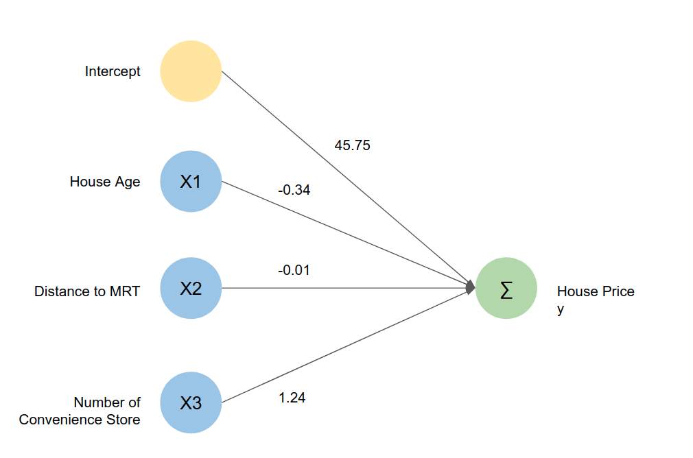
```

Well, what about classification? You may remember that there is a linear model for classification: the logistic regression, which is just a linear regression with extra step. The difference between linear regression with the logistic regression is that instead of direct relationship between the features and the target variable, the logistic regression is the relation between the features and the log of odds of the target variable. You can read more about logistic regression here[^5] since it is not our main focus.

$$
ln(\frac{p}{1-p}) =  \beta_0 + \beta_1 x_1 + \beta_2 x_2 + ... + \beta_n x_n
$$

Let's say we want to predict the bank loan default based on some features and we get the following model:

$$
log\ of\ odds (default) = -11.478 - 0.493\ student_{yes} + 0.006\ balance + 0.001\ income
$$

Since log of odds is not easily interpretable, we can acquire the probability of the loan to be default by using the sigmoid function:

$$
p = \frac{1}{1 + e^{-\beta_0 + \beta_1 x_1 + \beta_2 x_2 + ... + \beta_n x_n}}
$$

If it was represented as a network, it will be something like this:

```{r echo=FALSE}
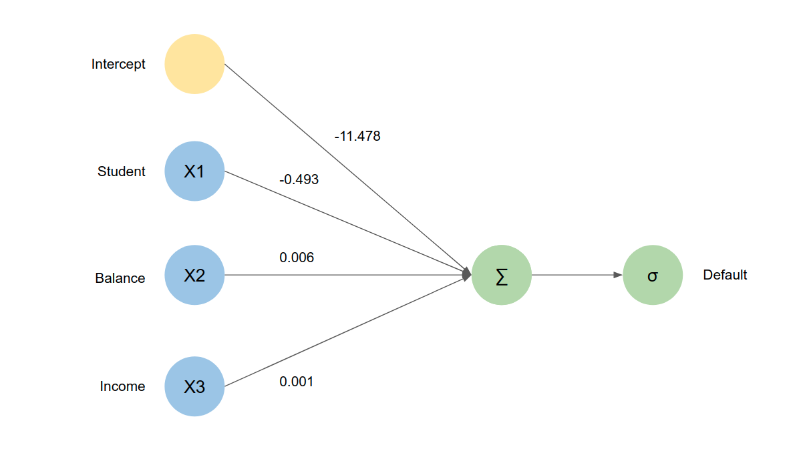
```

If you look at both linear and logistic regression, you can see that both of them flow directly from input to output via some function. So what does this have to do with Neural Network?

Artificial Neural Network has 3 different kind of "layer" inside the network:

- *Input layer*: Consists of the input features
- *Hidden layer*: Layer to extract and process information from the input layer
- *Output layer*: Layer to process and store the output or the prediction

The basic unit of computation in a neural network is the neuron, often called a node or unit. It receives input from some other nodes, or from an external source and computes an output. Each input has an associated weight (w), which is assigned on the basis of its relative importance to other inputs.

```{r echo=FALSE}
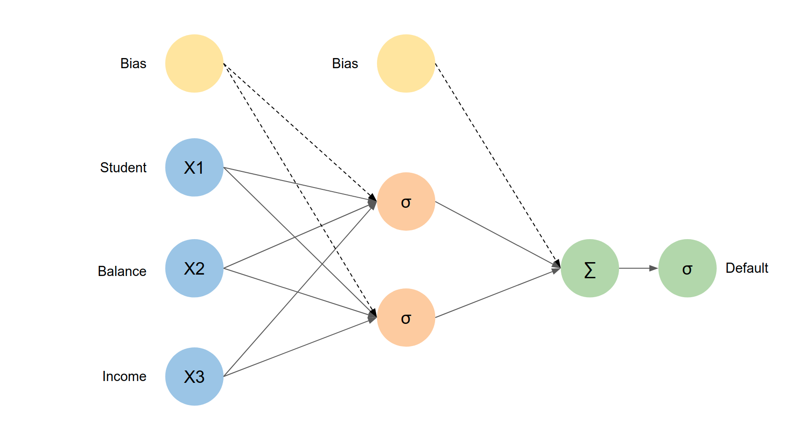
```

While neural network architecture can vary in forms and design, each of them can be characterized by:

- Number of layers in the network
- Number of nodes in each layer
- Direction of signals in the network

This architectural design allow us to accommodate varying degree of complexity; a more complex network (typically means more number of layers in the network) are capable of modelling more subtle patterns within our data, and while size typically matters, the design of the architecture also plays a part in the effectiveness of a neural network. The term *Deep Learning* generally refer to a neural network with two or more hidden layers.

```{r echo=FALSE}
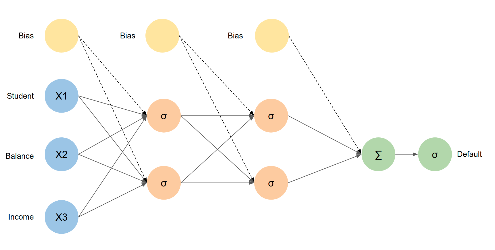
```

## Direction of Signals

Neural networks can be recurrent or feed-forward. A feed-forward neural network is one where the input signal is fed continuously in one direction from layer to layer until reaching the final output layer. Despite its apparent restriction, these networks can be very well-suited and form the “foundation” of a full neural network model. In contrast, a recurrent neural network (feedback network) is one where signals travel in both directions using loops and unlike a feedforward network can use an internal state to process sequences of input, which gives it the ability to “exhibit dynamic temporal behavior for a time sequence”, and see its use throughout vocabulary speech recognition or in time series forecasting[^6].

```{r echo=FALSE}
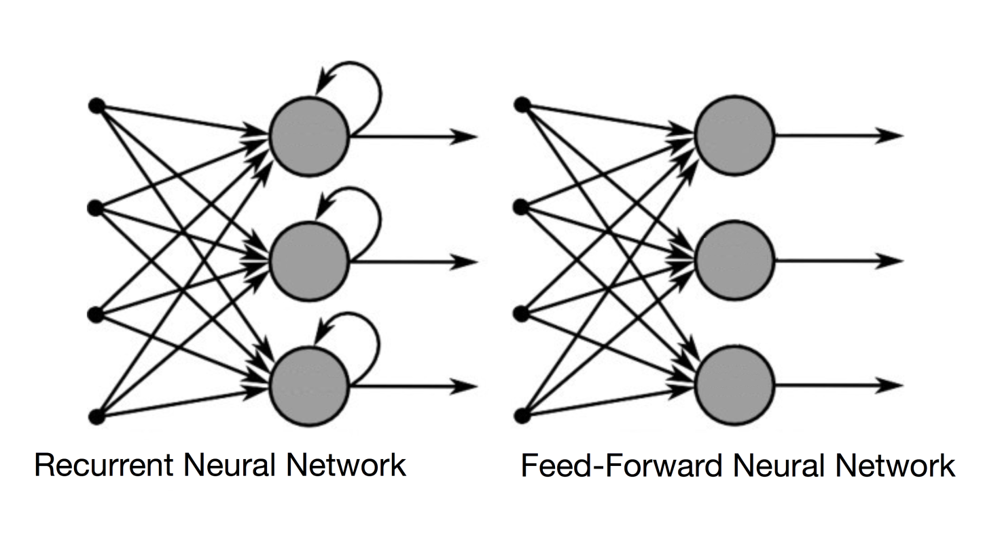
```


## Recurrent Neural Network

In Recurrent Neural Network (RNN), neurons are fed information not just from the previous layer but also from themselves from the previous pass[^7]. RNN comes into the picture when we want to store previous information while processing the new information. This previous information is termed as a memory. This network works really great on the sequence of data. Data such as text and audio comes under sequence of data. For example in language processing, to predict the next words, the network should have some knowledge about the previous words.

```{r echo=FALSE}
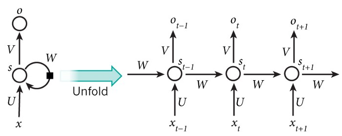
```

The above-shown figure is an unrolled recurrent neural network. In this context, unrolling simply means the number of times the part of data is being passed. For example, if we are using a sentence at its input then the length of the network will be the count of words in that sentence. That is one layer for each word. In that way, it can keep track of it:

-   **x**: part of the data applied to the network. By part of the data, I mean a single word.
-   **o**: is the output of each network. Suppose we are using this network for the prediction of next work then it will be all the possibility of vocabulary probability provided. Depending on the task, it will not necessary to spit out the results after each intermediate steps.
-   **s**: is the memory which is being passed on to the successive network. It can be shown as $s(t) = f(W * s (t-1) + U*x(t))$.

Unfortunately, the range of contextual information that standard RNNs can access is in practice quite limited. Suppose that we build a language model to predict the last word in the text:

> I have lived in Indonesia for more than 20 years, I speak fluent Indonesian.

Recent information (I speak fluent ...) suggests that the next word is probably the name of a language. But if we want to narrow down which language, we need the context of "Indonesia", from further back. It's entirely possible for the gap between the relevant information and the point where it is needed to become very large. The problem with RNN is as that gap grows, RNNs become unable to learn to connect the information. This is where LSTM will come in.

## Long Short Term Memory (LSTM) Network

The Long Short Term Memory architecture was motivated by an analysis of error flow in existing RNNs which found that long time lags were inaccessible to existing architectures, because backpropagated error either blows up or decays exponentially. An LSTM layer consists of a set of recurrently connected blocks, known as memory blocks. These blocks can be thought of as a differentiable version of the memory chips in a digital computer. Each one contains one or more recurrently connected memory cells and three multiplicative units -- the input, output and forget gates -- that provide continuous analogues of write, read and reset operations for the cells.

The following figures illustrate what it is look like inside the LSTM layer.

```{r echo=FALSE}
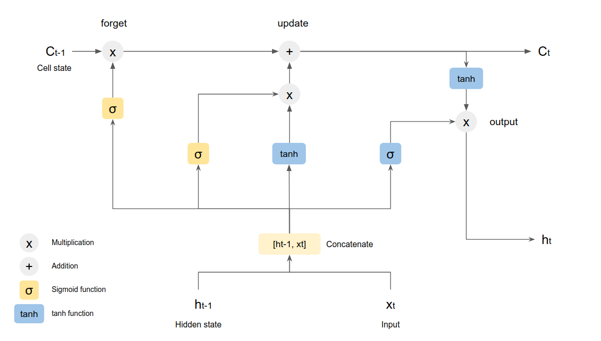
```

The components in LSTM consist of[^8]:

-   **Hidden State**: The output of each state in LSTM network
-   **Memory/Cell State**: The information or context that will be used internally in LSTM network
-   **Forget Gate**: Determine how much memory/information from the previous state should be forgotten. Regulated by the sigmoid activation function which will give output range between 0 and 1, with 0 means completley forget while 1 means completely retain. The previous cell state will be multiplied by the output of the sigmoid transformation from the previous hidden state and the input of the current state.

$$
f_t = \sigma(W_f .[h_{t-1}, x_t] + b_f)
$$

-   **Input Gate**: The candidate layer will determine which value that we will update. Similar to forget gate, the input gate is regulated by the sigmoid function.

$$
i_t = \sigma(W_i .[h_{t-1}, x_t] + b_i)
$$

-   **Candidate Layer**: Candidate layer will create a new candidate value for the next state. This gate is regulated by tanh activation function.

$$
\widetilde C_t = tanh(W_C .[h_{t-1}, x_t] + b_C)
$$

The result of the multiplication between input gate and the candidate layer will be added to the output of the forget process and will give us the new values for the current cell state, which will be used in the next state.

$$
C_t = f_t * C_{t-1} + i_t * \widetilde C_t
$$

-   **Output Gate**: The output gate will regulate what values are we going to give as the output of the current state. This gate is also regulated by the sigmoid function. After we have acquired the current Cell state, we will multiply it by the result of the output gate to get the current Hidden state, which will be the final output.

$$
o_t = \sigma(W_o .[h_{t-1}, x_t] + b_o)\\
h_t = o_t * tanh(C_t)
$$

# Model Architecture

The model will use embedding layer as the input layer. In a variety of deep learning frameworks such as Keras, the embedding layer aims to train text data into numerical vectors which represent the closeness of the meaning of each word. The context and feature of the text will be extracted using the recurrent network of LSTM layer. To avoid overfitting, we will use the `Elastic Net` regularizer that use both `L1` and `L2` norm to penalize the loss function. The regularizer will help enforce the training process to steer towards relatively “simple” weights, which may make your model more generic and thus scalable[^9]. The formula of the elastic net is as follows:

$$
L(f,x,y) = L(f,x,y) + \lambda_1 \Sigma_{i = 1}^n |w_i| + \lambda_2 \Sigma_{i = 1}^n w_i^2
$$

- $f$: the model
- $x$: input vector
- $y$: truth value/actual class
- $L(f,x,y)$: The loss function
- $w_i$: the weight of the neuron $i$ in the network
- $\lambda_1$: the L1 coefficient
- $\lambda_2$: the L2 coefficient

```{r}
# Set Random Seed for Initial Weight
tensorflow::tf$random$set_seed(123)

# Build model architecture
model <- keras_model_sequential(name = "lstm_model") %>% 
  layer_embedding(name = "input",
                  input_dim = num_words,
                  input_length = maxlen,
                  output_dim = 8
                  ) %>% 
  layer_lstm(name = "LSTM",
             units = 8,
             kernel_regularizer = regularizer_l1_l2(l1 = 0.05, l2 = 0.05),
             return_sequences = F
             ) %>% 
  layer_dense(name = "Output",
              units = 1,
              activation = "sigmoid"
              )

model
```

# Model Fitting

Since the model will be trained to classify between 2 classes, we will use the `binary cross-entropy` as the loss function. To update our model and minimize the loss function, we use the `adam` optimizer with learning rate of 0.001. The model trained with 9 epoch and the model will be updated every 64 observations, which we call as the batch size. We will also use 10% of the training dataset as the validation dataset to monitor if the model will go overfit after some time.

```{r eval=FALSE}
model %>% 
  compile(optimizer = optimizer_adam(lr = 0.001),
          metrics = "accuracy",
          loss = "binary_crossentropy"
          )

epochs <- 9
batch_size <- 64

train_history <- model %>% 
  fit(x = train_x,
      y = train_y,
      batch_size = batch_size,
      epochs = epochs,
      validation_split = 0.1, # 10% validation data
      
      # print progress but don't create graphic
      verbose = 1,
      view_metrics = 0
      )

plot(train_history) +
  geom_line()
```

I've prepared the pre-runed model and the following chunk contains the result of the training. As we can see, the training and validation data don't have much different loss or accuracy, therefore we can be sure that our model is not overfitting.

```{r}
# Load Saved Model
model <- load_model_hdf5("output/model.hdf5")

# Load saved training history
train_history <- read_rds("output/train_history.rds")

plot(train_history) +
  geom_line(lwd = 1) 
```

Here is the comparison of the same model but if we remove the regularizer. The model will easily overfit as the loss of the data train keep going down while the validation data being stagnant.

```{r echo=FALSE}
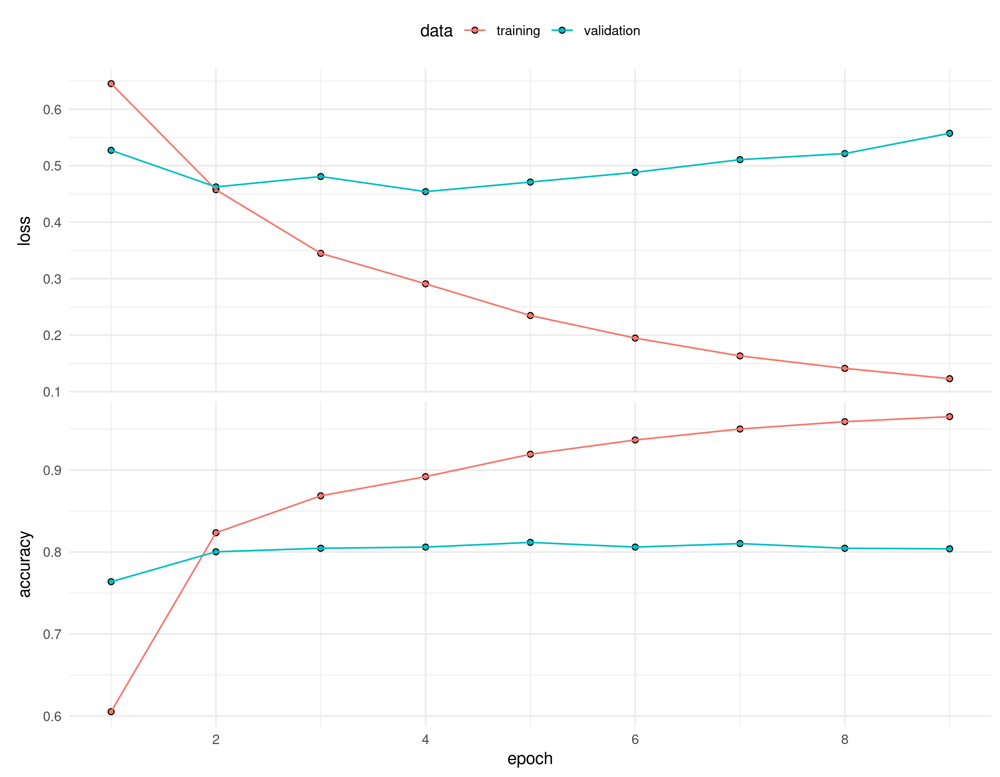
```

# Model Evaluation

Now we will predict the data test using the trained deep learning model.

```{r}
# Predict data test
pred_test <- predict_classes(model, test_x)

# Check the first 10 prediction
head(pred_test, 10)
```

Let's convert the class label into a proper phrase (`Recommended`, `Not Recommended`) and check the confusion matrix.

```{r}
# Convert the target class into proper labels
decode <- function(x) factor(ifelse(x == 0, "Not Recommended", "Recommended"),
                             levels = c("Recommended", "Not Recommended"))

pred_class <- decode(pred_test)
true_class <- decode(data_test$user_suggestion)

# Confusion Matrix
table("Prediction" = pred_class, "Actual" = true_class)
```

In classification problem, we evaluate model by looking at how many of their predictions are correct. This can be plotted into something called *Confusion Matrix*.

```{r echo=FALSE}
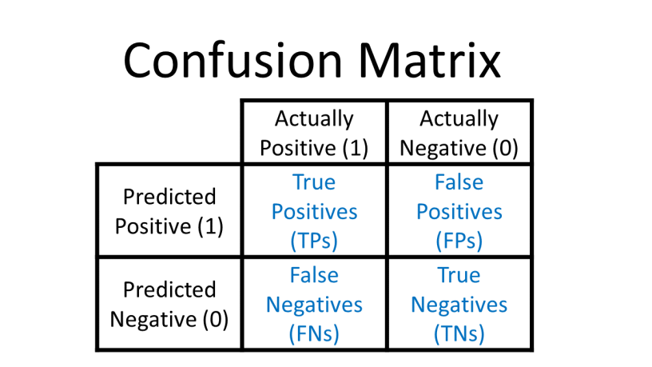
```

The matrix is divided into four area:

-   **True Positive (TP)**: The model predict user will recommend (*Positive*) and the prediction is correct (*True*)
-   **False Positive (FP)**: The model predict user will recommend (*Positive*) and the prediction is incorrect (*False*)
-   **True Negative (TN)**: The model predict user will not recommend (*Negative*) and the prediction is correct (*True*)
-   **False Negative (FN)**: The model predict user will not recommend (*Negative*) and the prediction is incorrect (*False*)

From the result of our model performance, here is the four values of the confusion matrix:

-   **True Positive (TP)**: 1681
-   **False Positive (FP)**: 263
-   **True Negative (TN)**: 1225
-   **False Negative (FN)**: 322

Finally, we can evaluate the model using the main performance metrics: accuracy, recall, and precision. The following formula is how each metric is calculated from the confusion matrix.

$$
Accuracy = \frac{TP + TN}{ TP + TN + FP + FN}\\
Recall = \frac{TP}{TP + FN}\\
Precision = \frac{TP}{TP + FP}\\
F1 = 2\ \frac{Precision\times Recall }{Precision + Recall}
$$

```{r}
data.frame(
           Accuracy = accuracy_vec(truth = true_class, estimate = pred_class),
           Recall = sens_vec(truth = true_class,estimate =  pred_class),
           Precision = precision_vec(truth = true_class, estimate =  pred_class),
           F1 = f_meas_vec(truth = true_class, estimate =  pred_class)
           ) %>% 
  mutate_all(percent, accuracy = 0.01)
```

-   **Accuracy**

Accuracy simply tell us how many prediction is true compared to the total dataset. On the following figure, you can interpret `Yes` as recommended while `No` as not recommended.

```{r echo=FALSE}
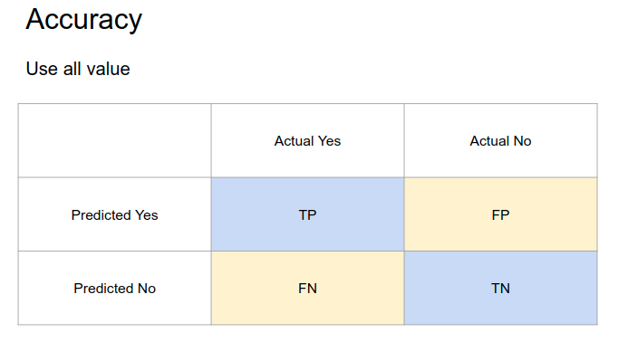
```

$$
Accuracy = \frac{TP + TN}{TP + TN + FP + FN}
$$

```{r echo=TRUE}
(1681 + 1225) / (1681 + 1225 + 263 + 322)
```

From all data in testing dataset, only 67% of them are correctly predicted as buy/not buy.

$$
Accuracy = \frac{1648 + 581}{1648 + 581 + 791 + 298} = 0.67179 = 67.18\%
$$

-   **Sensitivity/Recall**

Recall/sensitivity only concerns how many customers that actually buy can correctly be predicted. The metric don't care about the customer that don't actually buy our product.

```{r echo=FALSE}
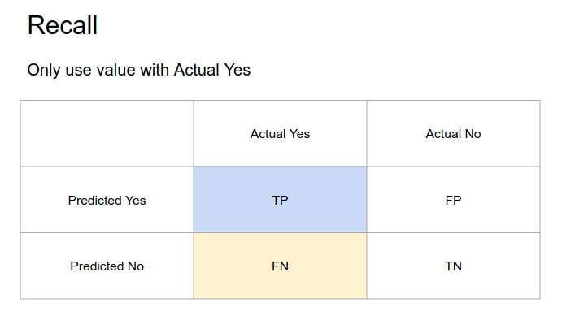
```

$$
Recall = \frac{TP}{TP + FN}
$$

```{r echo=TRUE}
(1681) / (1681 + 322)
```

From all customer that actually buy our product, 84% of them are correctly predicted as buy and 16% as not buy.

$$
Recall = \frac{1681}{1681 + 322} = 0.8392 = 83.92\%
$$

-   **Precision**

Precision only concern on how many positive prediction that are actually correct. The metric don't care about customer that is predicted not buy.

```{r echo=FALSE}
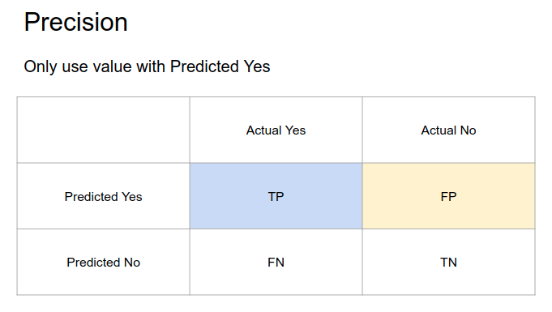
```

$$
Precision = \frac{TP}{TP + FP}
$$

```{r echo=TRUE}
1681 / (1681 + 263)
```

From all customer that is predicted to buy, only 67% of them that are actually buy our product.

$$
Precision = \frac{1681}{1681 + 263} = 0.8647 = 86.47\%
$$

-   **F1 score**

The F1 score is the harmonic mean of the precision and recall. It seeks to balance or consider both precision and recall.

$$
F1 = 2\ \frac{Precision\times Recall }{Precision + Recall}
$$

```{r}
2 * (0.8647119 * 0.8392411) / (0.8647119 + 0.8392411)
```

$$
F1 = 2\ \frac{0.8647119 \times 0.8392411 }{0.8647119 + 0.8392411 } = 0.8518 = 85.15\%
$$

# Additional: Naive Bayes

Now we will try to compare the Deep Learning model with more simple model of Naive Bayes, which is often used as a benchmark model. The difference between using deep learning and using naive bayes is that naive bayes only use the concept of `bag of words`, which is simply use the frequency or other metrics to represent the quantity of each words in each text, therefore the model will not learn about words as a sequence.

## Tokenization

We will manually tokenize the data and use `tidytext` package to get the job done.

```{r eval=FALSE}
train_token <- data_train %>% 
  select(review_id, text_clean) %>% 
  unnest_tokens(output = "word",
                input = text_clean)

test_token <- data_test %>% 
  select(review_id, text_clean) %>% 
  unnest_tokens(output = "word",
                input = text_clean)

head(train_token)
```

## Remove Stop Words

Unlike in LSTM where we can look for context of sequence of text, in Naive Bayes we only care about the `bag of word` or the frequency (sometimes the TF-IDF value) of the corpus. Here, we will remove the unnecessary and frequent words, often called as `stop words`. Here we use the stop words provided by `tidytext`.

```{r eval=FALSE}
train_token <- train_token %>% 
  filter(!word %in% stop_words$word)

test_token <- test_token %>% 
  filter(!word %in% stop_words$word)
```

## Stemming

The goal of both stemming and lemmatization is to reduce inflectional forms and sometimes derivationally related forms of a word to a common base form. Here we will use the `hunspell` package to do word stemming. The Hunspell is the spell checker library used by LibreOffice, OpenOffice, Mozilla Firefox, Google Chrome, Mac OS-X, InDesign, Opera, RStudio and many others. It provides a system for tokenizing, stemming and spelling in almost any language or alphabet. Hunspell uses a special dictionary format that defines which characters, words and conjugations are valid in a given language.

```{r}
stem_hunspell <- function(term) {
  # look up the term in the dictionary
  stems <- hunspell_stem(term)[[1]]
  
  if (length(stems) == 0) { # if there are no stems, use the original term
    stem <- term
  } else { # if there are multiple stems, use the last one
    stem <- stems[[length(stems)]]
  }
  return(stem)
}

# Example
stem_hunspell("walking")
```

We use parallel computing to do the hunspell stemming to speed up the process.

```{r eval=FALSE}
library(furrr)
plan(multisession, workers = 4) # number of cpu core

train_token <- train_token %>% 
  mutate(word = future_map_chr(word, stem_hunspell))

test_token <- test_token %>% 
  mutate(word = future_map_chr(word, stem_hunspell))
```

I've also prepared the already processed data if you don't want to wait.

```{r echo=T}
train_token <- read_rds("output/train_stem.rds")
test_token <- read_rds("output/test_stem.rds")
```

Next, we will get words that appear in at least 80% of all document and words that appear in less than 5 documents in data train. The purpose of this step is to remove common words and rare words that may hold little information.

```{r}
# Find number of word appearance in the corpus
frequent_token <- train_token %>% 
  count(review_id, word) %>% 
  count(word, name = "appearance") %>% 
  arrange(desc(appearance))

# Number of Documents
number_of_document <- n_distinct(train_token$review_id)

# Get word that appear in at least 80% of all document
top_word <- frequent_token %>% 
  filter(appearance >= (number_of_document * 0.8)) %>% 
  pull(word)

# Get word that appear in less than 5 document
low_word <- frequent_token %>% 
  filter(appearance <= 5) %>% 
  pull(word)

custom_stop_word <- c(top_word, low_word)

head(custom_stop_word, 10)
```

We filter the custom stop words from our tokenized data.

```{r }
train_token <- train_token %>% 
  filter(!word %in% custom_stop_word)

test_token <- test_token %>% 
  filter(!word %in% custom_stop_word)
```

## Document-Term Matrix

Finally, we will create the Document-Term Matrix (DTM). A DTM is a matrix with each document/text represented as rows while each word represented as columns, with the value of the cell is the frequency.

```{r}
train_dtm <- train_token %>% 
  count(review_id, word) %>% 
  cast_dtm(document = review_id,
           term = word,
           value = n) 

test_dtm <- test_token %>% 
  count(review_id, word) %>% 
  cast_dtm(document = review_id,
           term = word,
           value = n)

tm::inspect(train_dtm)
```

We then convert the value in Document-Term matrix into categorical, whether the word present (has frequency \> 0) or not. This will simplify the model because we don't actually care about the quantity and only concern with the presence of words.

```{r eval=FALSE}
bernoulli_conv <- function(x){
        x <- as.factor(ifelse(x > 0, 1, 0))
}

train_bn <- apply(train_dtm, 2, bernoulli_conv)
test_bn <- apply(test_dtm, 2, bernoulli_conv)
```

## Model Fitting

After all data is properly processed, now we will build the Naive Bayes model. I will not explain further about Naive Bayes since this is not our main topics. However, you can check this simple explanation about Naive Bayes algorithm from Saed Sayad[^10].

```{r eval=FALSE}
# Get the training target variable
train_y <- data_train %>% 
  filter(review_id %in% train_dtm$dimnames$Docs) %>% 
  pull(user_suggestion) %>% 
  decode()

# Train the model
model_bayes <- naiveBayes(train_bn, train_y)
```

## Model Evaluation

We then predict the data using the data test.

```{r eval=FALSE}
pred_test <- predict(model_bayes, test_bn, type = "class")

head(pred_test)
```

```{r echo=FALSE}
# Pre-saved prediction result
pred_test <- read_rds("output/pred_bayes.rds")
head(pred_test)
```

Check the Confusion Matrix

```{r}
test_y <- data_test %>% 
  filter(review_id %in% test_dtm$dimnames$Docs) %>% 
  pull(user_suggestion) %>% 
  decode()

# Confusion Matrix
table("Prediction" = pred_test, "Actual" = test_y)
```

Finally, let's check the model performance. Deep learning with LSTM is simply outperform the Naive Bayes because it is able to extract more information.

```{r}
data.frame(Accuracy = accuracy_vec(test_y, pred_test),
           Recall = sens_vec(test_y, pred_test),
           Precision = precision_vec(test_y, pred_test),
           "F1 Score" = f_meas_vec(test_y, pred_test),
           check.names = F
           ) %>% 
  mutate_all(percent, accuracy = 0.01)
```

# Reference

[^1]: [Qian Li, Hao Peng, Jianxin Li, Congyin Xia, Renyu Yang, Lichao Sun, Philip S. Yu, and Lifang He. 2020. A Survey on Text Classification: From Shallow to Deep Learning. ACM Comput. Surv. 37, 4, Article 35 (July 2020), 35 pages](https://arxiv.org/pdf/2008.00364v2.pdf)
[^2]: [Dwarampudi M. Reddy and N. V. Subba Reddy. 2019. Effects on Padding on LSTMs and CNNs](https://arxiv.org/abs/1903.07288)
[^3]: [Wikipedia, Grandmother Cell](https://en.wikipedia.org/wiki/Grandmother_cell)
[^4]: [Learn.Genetics, Genetic Science Learning Center, UTAH.](http://learn.genetics.utah.edu/content/neuroscience/neurons/)
[^5]: [Saed Sayad. Logistic Regression](http://www.saedsayad.com/logistic_regression.htm)
[^6]: [Frank Günther and Stefan Firtsch. 2010. Training of Neural Networks. The R Journal 2, 1. 30-38.](https://journal.r-project.org/archive/2010/RJ-2010-006/RJ-2010-006.pdf)
[^7]: [Fjodor Van Veen. 2016. The Neural Network Zoo.](https://www.asimovinstitute.org/neural-network-zoo/)
[^8]: [Christopher Olah. 2015. Understanding LSTM Networks](http://colah.github.io/posts/2015-08-Understanding-LSTMs/) 
[^9]: [Christian Versloot. 2020. How to use L1, L2 and Elastic Net Regularization with TensorFlow 2.0 and Keras?](https://www.machinecurve.com/index.php/2020/01/23/how-to-use-l1-l2-and-elastic-net-regularization-with-keras/)
[^10]: [Saed Sayad. Naive Bayesian](http://www.saedsayad.com/naive_bayesian.htm)